# Lab 01 Report - Introduction to Open Source Software

## 1. Discord

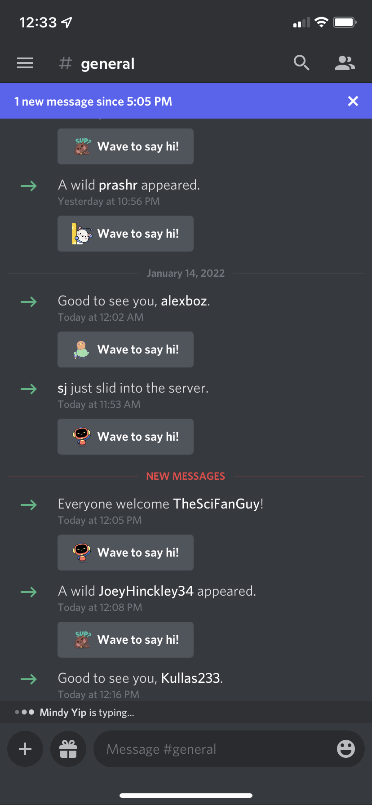

## 2. Reading Assignments

 3. 2 additional suggestions: Don't be hostile or accusatory - never attribute malice to that which can as easily be explained by ignorance. Offer another person that can help if they still seem unsure after your explanation, and don't take it personally.

 4. The chapter of Free Culture demonstrated to me the absurdity of trying to lock down and gate software, and the faults of the US legal system in regard to software. By simply modifying freely available existing code and working on a technology that interested him, with no real end goal, Jesse had made himself a target of the predatory US legal system. By exploiting laws that required "damages" to be paid on copyright infringements and their power to litigate, the RIAA made an example out of the harmless actions of a tech student to warn pirates. It doesn't matter that the case would have likely been eventually won by Jesse, because our legal system gives huge advantages to organizations with the time and money to harass smaller companies and individuals. The technology that Jesse was working on was an aggregate search engine that simply expedited the ability of students to retrieve any files on the local network, and had nothing to do with pirated music specifically. Throwing up gates to software development and laying blame on developers hinders useful technological innovation, can ruin peoples' lives, and only serves to benefit the wealthy and powerful.

 ## 3. Linux

 

 ## 4. Regex
 
  1. Regex One
  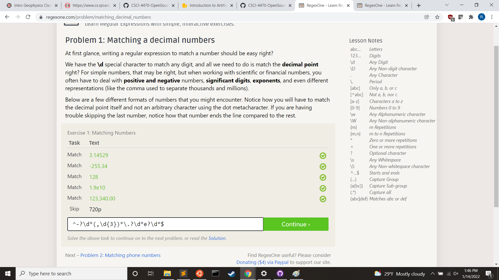
  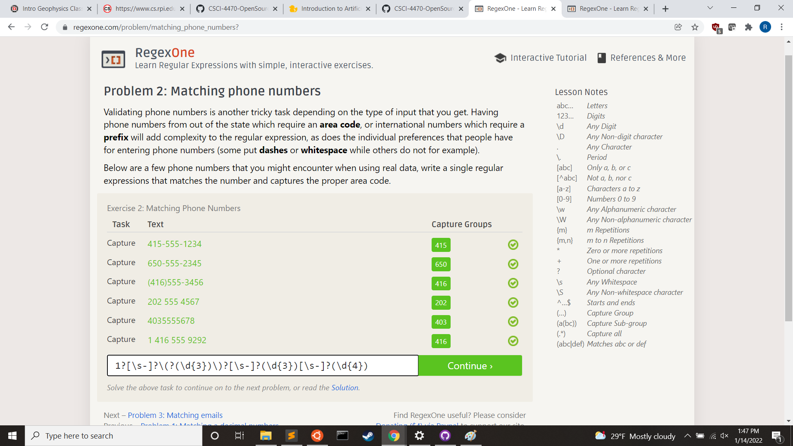
  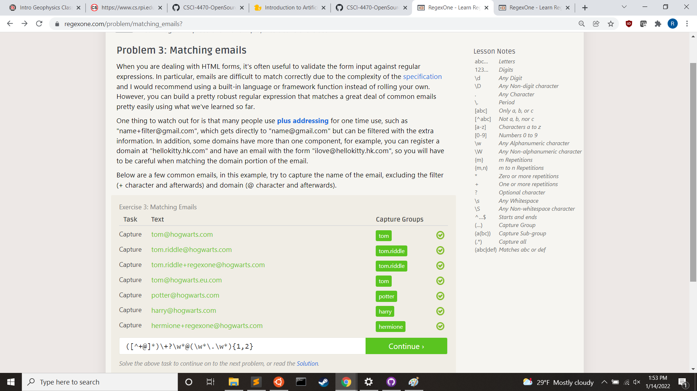
  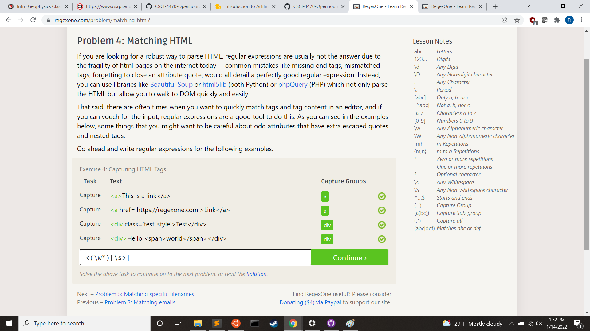
  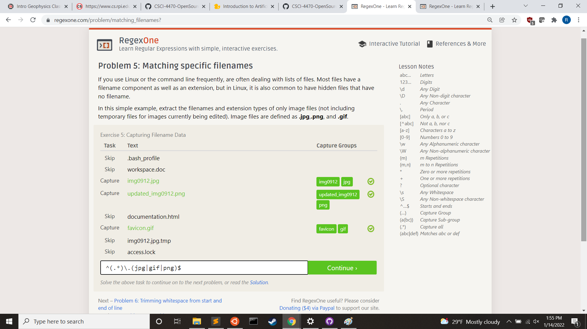
  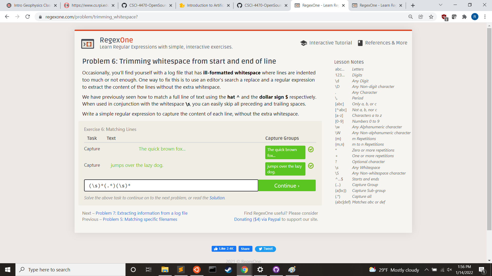
  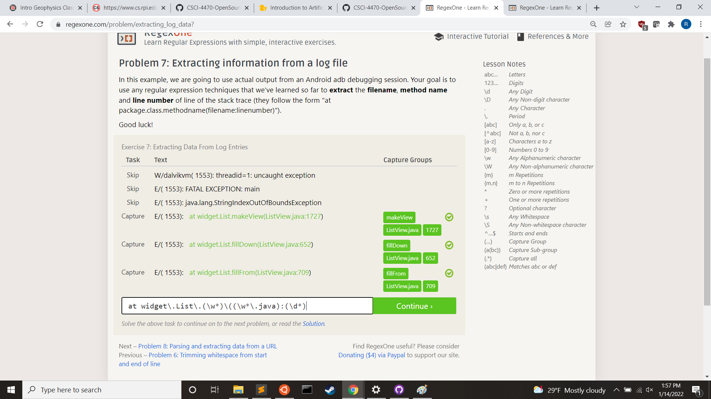

  2. Regex Crosswords
  
  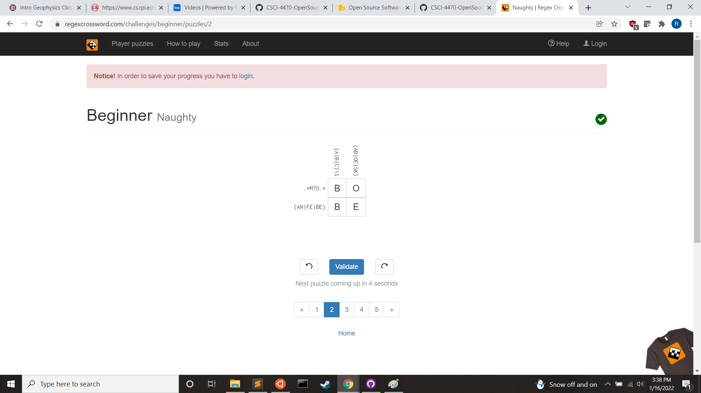
  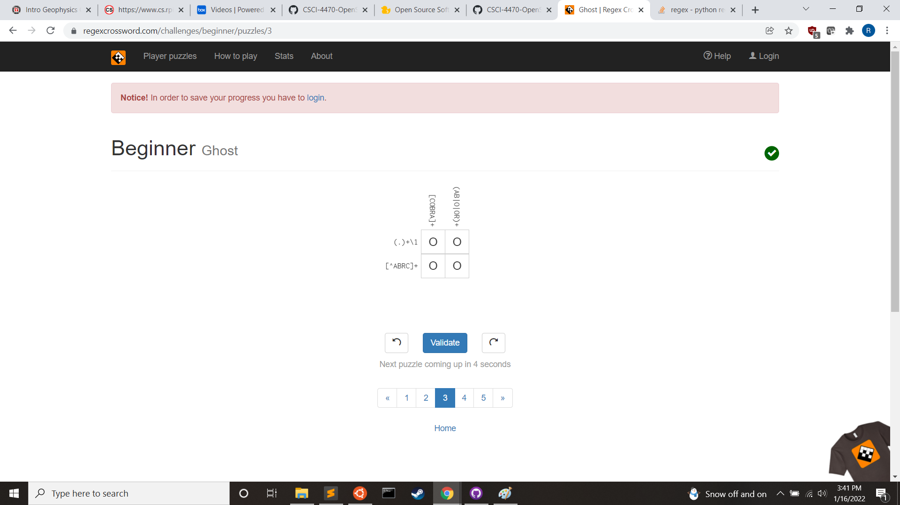
  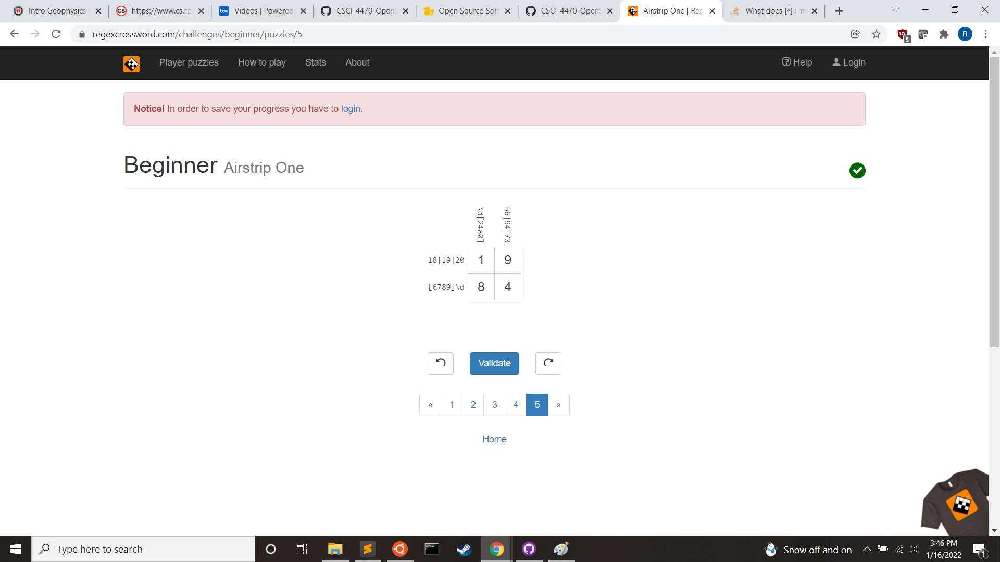

  ## 5. Blockly

  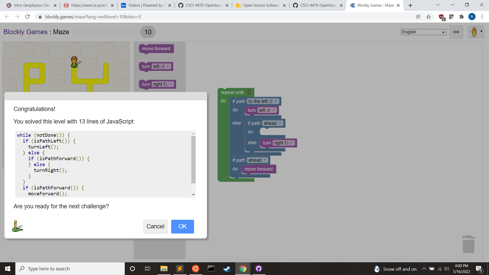

  ## 6. Reflection

  The open source software that interested me the most from the list was Audacity. This is because anyone who has any amount of experience editing videos or audio has used or at least heard of the software, and while I'm not an editor, I've even had it installed on my machine before. It's a simple, useful tool that offers a lot of flexibility while being approachable. I did not know that the software was community-created and open source, but it makes sense considering its ubiquity and the fact that it's free and easy to use. The program is built on many libraries and consists of decades of code contributed by a small group of developers. The decision to remain open source seems to be a guiding principle for the dev team, and the program does not use any plugins or libraries that come with licensing issues.