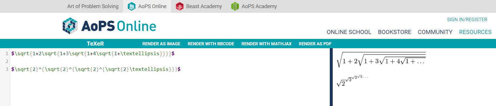
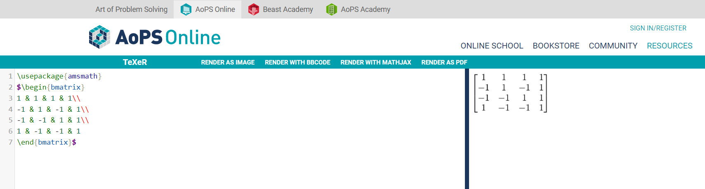
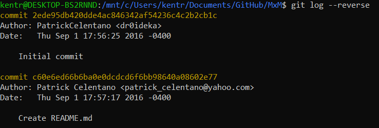
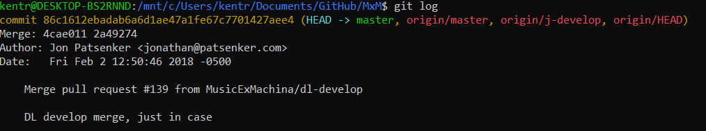
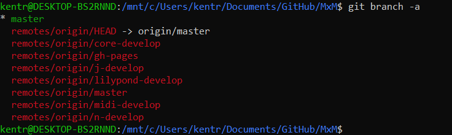
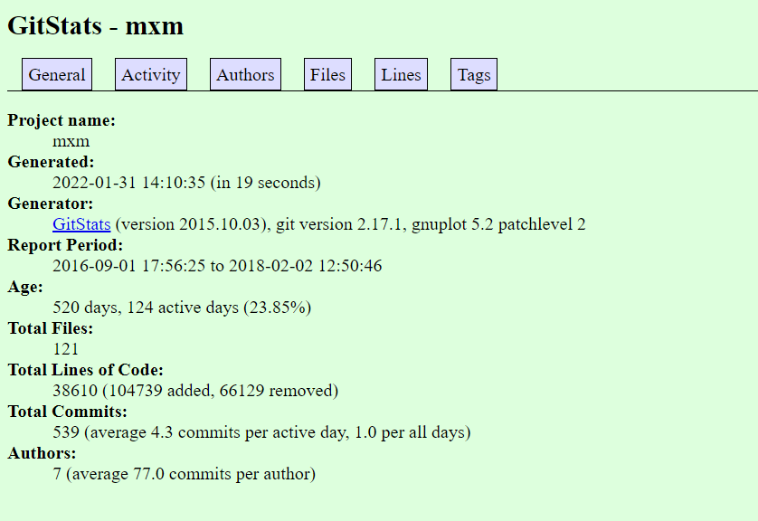

# Lab 03 Report - Documentation and Community

Note: I was unable to attend the online lab on friday, so I'm doing this lab by myself

# Part 1 - Documentation

Link to my wiki page with oss project idea: [Link](https://github.com/ryantk3nt/oss/wiki/Ryan-Kent's-Wiki)

Latex Formula: 
Latex Matrix: 

# Part 2 - Community

I randomly chose [MxM](https://github.com/musicexmachina/mxm) for the project to analyze for this section.

Number of contributors: 5

Number of lines: 39059

First Commit: 

Last Commit: 

Branches: 

GitStats results: 

The gitstats analysis shows a similar number of lines of code as the command line argument, but contains much more information about the repo. Graphs showing commits over time by author and other useful graphs and charts tell a more complete story of the project. 