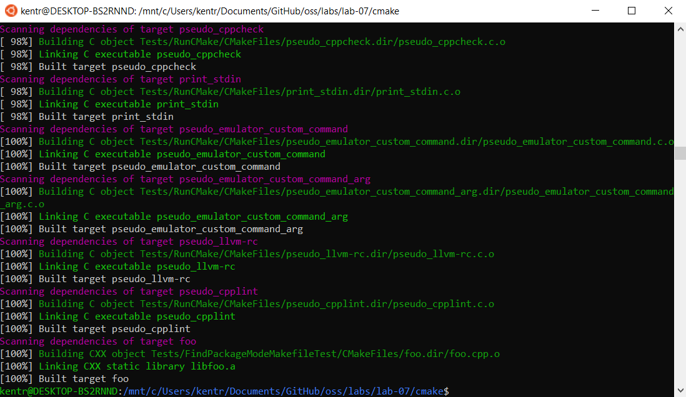
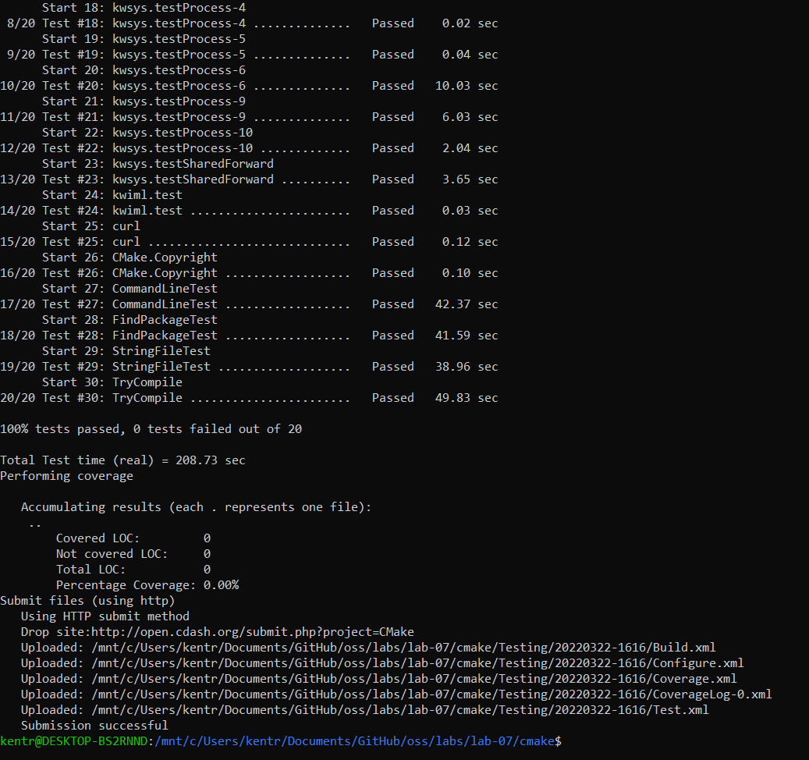
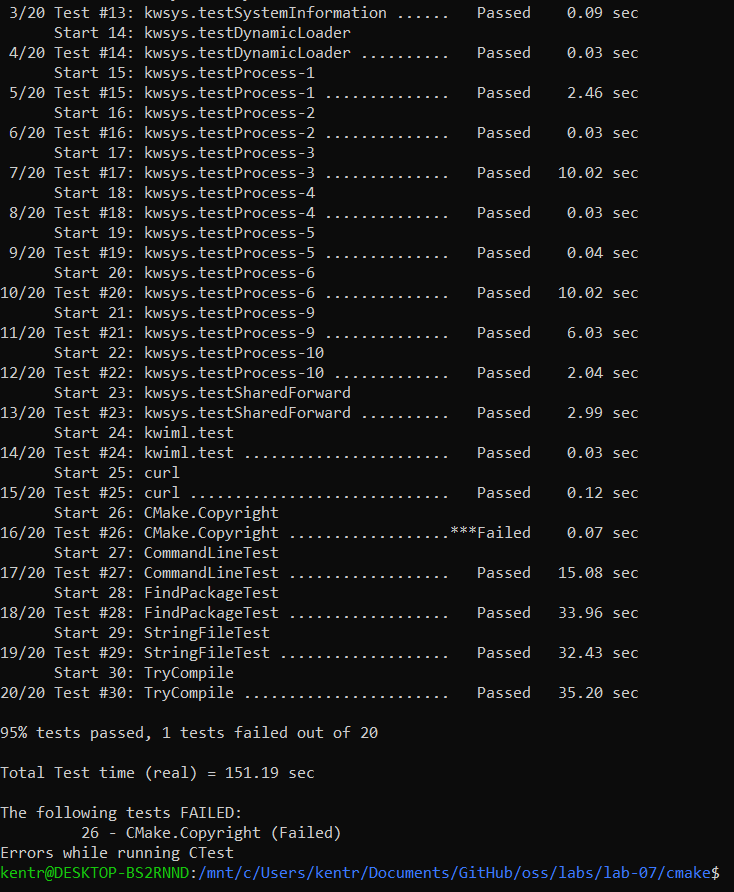
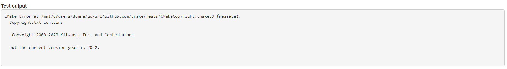
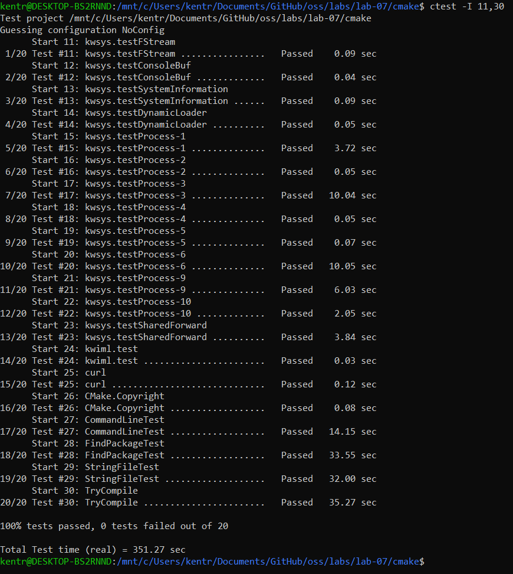
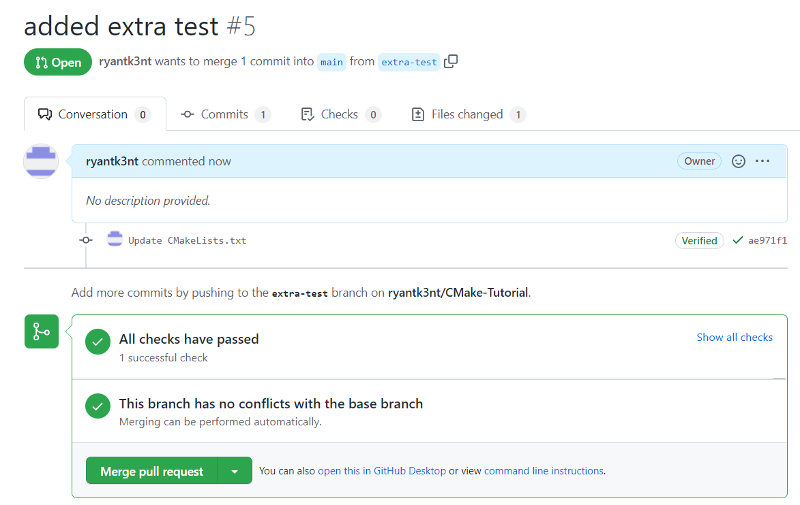

# Lab 07 Report - Testing and CI

## Checkpoint 1

Screenshot of build:

## Checkpoint 2

1. The test suite can be found by clicking on the build name, scrolling down to the test section, and clicking on View Tests Summary 

2. One test failed for one of the nightly builds. More information about the test can be found by clicking on the failed tests' name under the test summary. Detailed information about the expected vs. actual results are shown which are helpful with debugging

3. The windows build under master has a clean, tidy dashboard with no failed tests and build information.

Screenshot of submission:

## Checkpoint 3

Test submission with errors:

Debug info:

Fixed test submission:

## Checkpoint 4

Link to github repo: [Link](https://github.com/ryantk3nt/CMake-Tutorial)

Screenshot of github action check passing:

