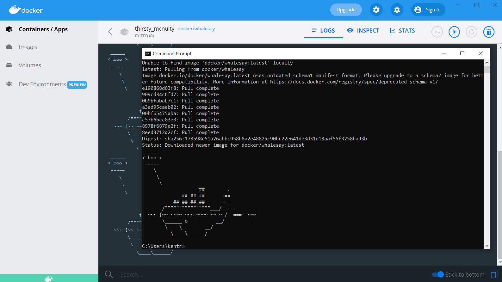
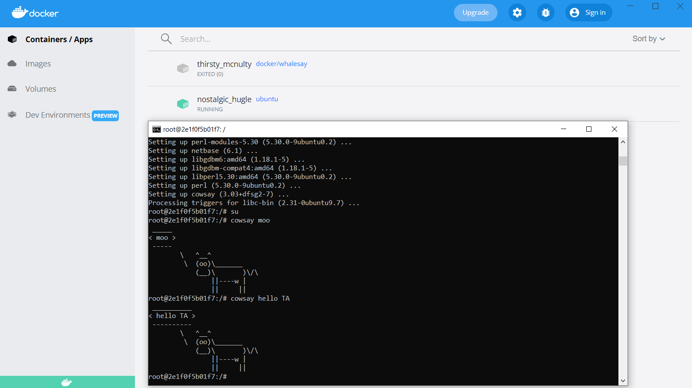
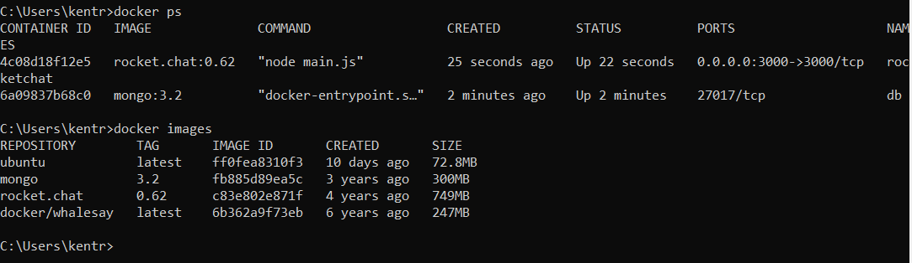
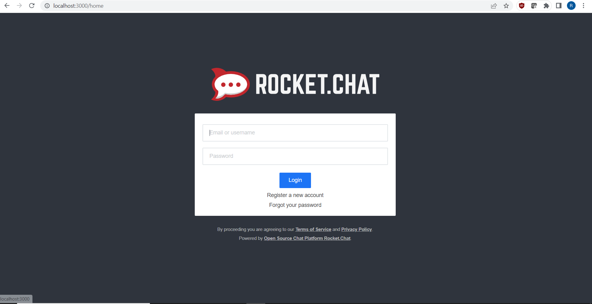
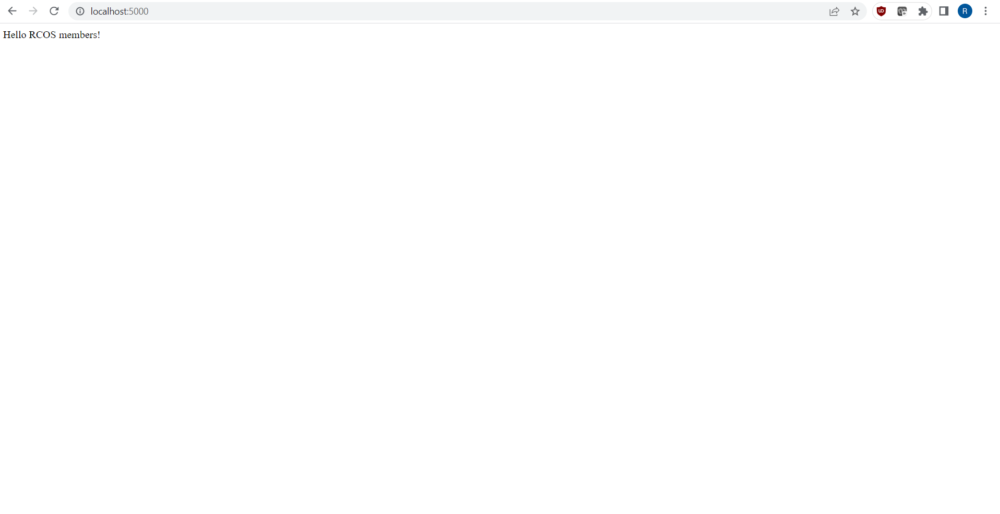
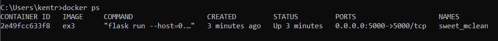
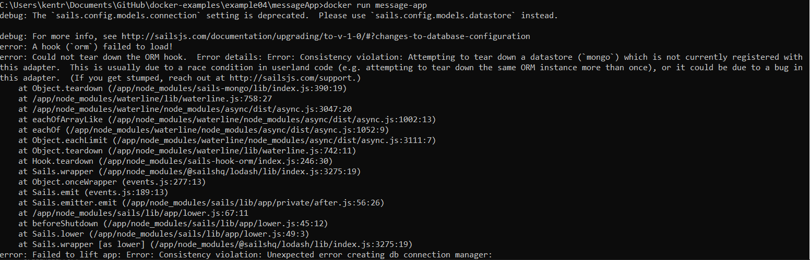
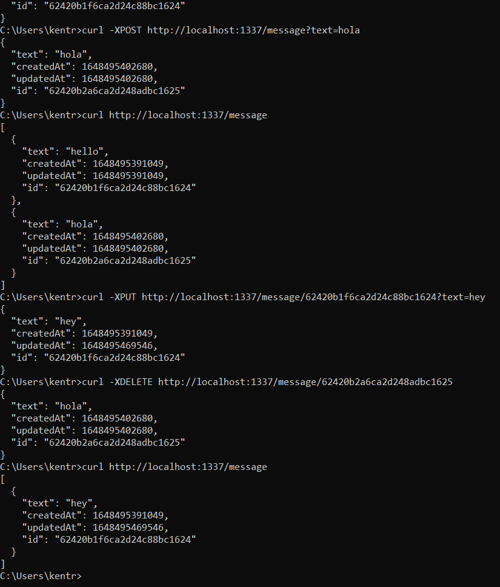

# Lab 8 - Virtualization and Docker

## Example 0

Screenshot: 

## Example 1

Screenshot of cowsay running on the ubuntu docker image: 

## Example 2

Screenshot of terminal showing rocketchat working:

Screenshot of rocketchat running on localhost:3000:

## Example 3

Screenshot of helloworld program running on localhost:5000:

Screenshot of terminal showing helloworld container:

## Example 4

Screenshot of failed first run of the app:

Screenshot of successful curl commands:

